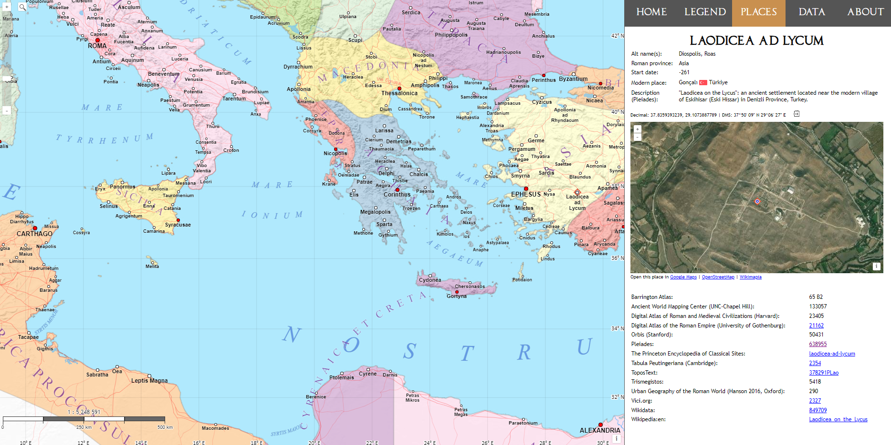
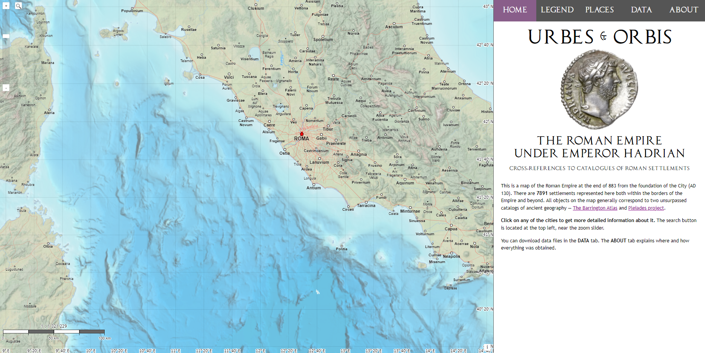

# [Urbes et Orbis](https://urbesetorbis.com/)
## Map of the Roman Empire under Emperor Hadrian
### Cross-references to the main catalogues of Roman settlements

This is a map of the Roman Empire at the end of AD 130. 

https://urbesetorbis.com

There are 7891 settlements represented here both within the borders of the Empire and beyond. All objects on the map generally correspond to two unsurpassed catalogs of ancient geography — [The Barrington Atlas](https://web.archive.org/web/20100530180105/http://www.unc.edu/awmc/batlas.html) and [Pleiades project](https://pleiades.stoa.org/).

 
The project has two main goals. The first is to present, using modern means, an interactive map of the Roman Empire at the time of the founding of Antinoopolis. The second goal is to connect disparate scientific databases of ancient Roman settlements, collecting their IDs and hyperlinks to them in one place.

The project provides references and, where possible, hyperlinks to the following databases:

* Barrington Atlas
* Ancient World Mapping Center (UNC-Chapel Hill)
* Digital Atlas of Roman and Medieval Civilizations (Harvard)
* Digital Atlas of the Roman Empire (University of Gothenburg)
* Orbis (Stanford)
* Pleiades
* The Princeton Encyclopedia of Classical Sites
* Tabula Peutingeriana (Cambridge)
* ToposText
* Trismegistos
* Urban Geography of the Roman World (Hanson 2016, Oxford)
* Vici.org
* Wikidata
* Wikipedia:en

The whole project is made on OpenLayers v8, in the form of several layers from geojson files. The map base, including coastline and provincial outlines, is taken mainly from [Ancient World Mapping Center](http://awmc.unc.edu/awmc/map_data/). Numerous polygon errors have been fixed. Several provincial boundaries are aligned with geographic features.

Code licensed under the BSD-2-Clause. You can download maps and data in GEOJSON and CSV format in the DATA tab on the website or from the DATA and DOWNLOADS folders in this repository.

**If in some way someone's copyright has been violated or incorrectly attributed, please consider it an unintentional mistake and contact me.**

This non-profit project does not pretend to be scientific and was made for fun, and yet I tried to be accurate. I will gladly accept criticism and advice both on the content and on the program code. Please send your comments and suggestions.
