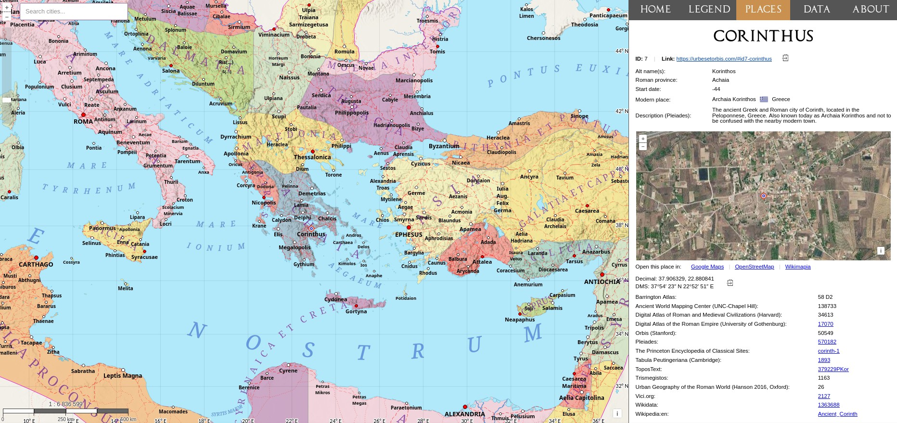

# Urbes et Orbis

## The Roman Empire under Emperor Hadrian

### A digital catalog of 7,891 Roman settlements with cross-references to 12+ scholarly databases

## About

**Urbes et Orbis** is an interactive map of the Roman Empire as it stood in AD 130 (year 883 ab Urbe condita) — the year of Antinoopolis's foundation. Built with OpenLayers v8, it visualises **7,891 settlements** across the Empire and beyond, each cross-referenced with the major scholarly databases of classical geography.

The project serves two purposes:

- A **research gateway** that aggregates identifiers from Pleiades, the Barrington Atlas, the Digital Atlas of the Roman Empire, and 9+ other sources in a single interface.
- A **digital cartography showcase** demonstrating how modern web GIS can present ancient geography with speed and interactivity.

> This is a non-commercial, personal project. Every effort has been made to ensure accuracy, but it does not claim to be a scholarly publication.

## Features

- **Interactive map** — pan, zoom, and explore the Roman world at its greatest extent under Hadrian.
- **Smart search** — find any of 7,891 settlements by name with fuzzy matching and instant navigation.
- **Rich place details** — each settlement shows: ancient/modern names, Roman province, chronological range, coordinates (decimal & DMS), and descriptions from Pleiades.
- **Cross-reference hub** — every settlement is linked to:
  - Pleiades · Barrington Atlas · Digital Atlas of the Roman Empire
  - ToposText · Trismegistos · Vici.org · Wikidata · Wikipedia
  - Harvard's DARMC · Stanford's ORBIS · Oxford's Hanson database
  - Princeton Encyclopedia of Classical Sites · Tabula Peutingeriana
- **Permalinks** — each settlement gets a stable URL (`#id130-slug`) for sharing and reference.
- **Satellite minimap** — a Google Satellite inset shows the modern terrain for any selected location.
- **Data downloads** — the full settlement dataset (CSV), ocean basemap (GeoJSON), and provincial boundaries (GeoJSON) are available for offline use.
- **Road network** — overlaid Roman roads classified by certainty (certain / conjectured / hypothetical) from the Itiner-e project.

## Data Sources

| Source | Content | Notes |
| --- | --- | --- |
| [Ancient World Mapping Center (UNC)](https://awmc.unc.edu/) | Coastlines, provincial boundaries, inland water | BSD-2 |
| [Pleiades](https://pleiades.stoa.org/) | Settlement gazetteer & descriptions | CC-BY 3.0 |
| [Digital Atlas of the Roman Empire](http://imperium.ahlfeldt.se/) | Settlement locations | consult original |
| [Barrington Atlas](https://web.archive.org/web/20100530180105/http://www.unc.edu/awmc/batlas.html) | Map directory references | consult original |
| [Hanson (Oxford) Cities Database](http://oxrep.classics.ox.ac.uk/databases/cities/) | Urban rank classification | academic attribution required |
| [Itiner-e](https://itiner-e.org/) | Roman road network | CC-BY 4.0 |
| [ToposText](https://topostext.org/) | Place references | consult original |
| [Trismegistos](https://www.trismegistos.org/geo/) | Place references | consult original |
| [Vici.org](https://vici.org/) | Place references | consult original |
| [DARMC (Harvard)](https://darmc.harvard.edu/) | Settlement & period references | consult original |
| [ORBIS (Stanford)](https://orbis.stanford.edu/) | Transport network references | consult original |
| Map tiles | Land & Ocean base by [MapTiler](https://www.maptiler.com/copyright/), hillshade by Esri | see providers for terms |

## Known Limitations

- **Mobile responsiveness** — the sidebar and map controls are not yet fully optimised for small screens.
- **Road geometry** — the road layer contains some geometric inaccuracies inherited from source data; a correction pass is planned.
- **Base map tiles** — the current tile set is from an older generation; a migration to a modern source is in progress.

## Tech Stack

| Layer | Technology |
| --- | --- |
| Map engine | [OpenLayers](https://openlayers.org/) v8 |
| Build tool | [Vite](https://vitejs.dev/) |
| Data format | GeoJSON |
| Clipboard | [ClipboardJS](https://clipboardjs.com/) |
| Styling | Vanilla CSS + Bootstrap 5.3 |

## License

The original code, cartographic layers, and compiled datasets in this repository are released under the **2-Clause BSD License**. See [LICENSE](LICENSE) for details.

**External data sources retain their own licenses.** See the [Data Sources](#data-sources) table above and the map's attribution control for detailed attribution. If any copyright has been inadvertently infringed, please contact me to rectify the matter.

## Contact

- **Site:** [urbesetorbis.com](https://urbesetorbis.com/)
- **Email:** <admin@urbesetorbis.com>
- **GitHub:** [Diasito/urbesetorbis](https://github.com/Diasito/urbesetorbis)

If you find this project useful for research, teaching, or inspiration — please consider starring the repository. Contributions, corrections, and suggestions are warmly welcome.

**Version 2.0** · © 2023–2026 Diasito
