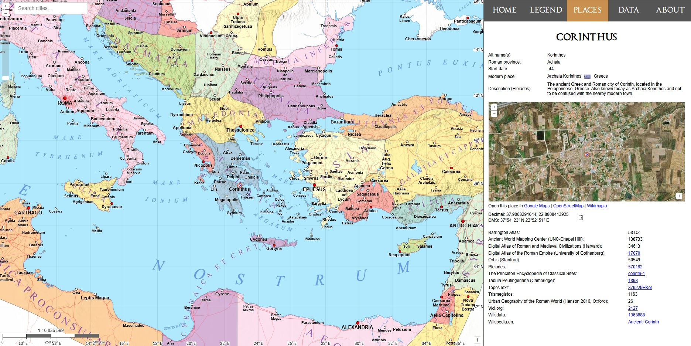

# Urbes et Orbis

## The Roman Empire under Emperor Hadrian

### A digital catalog of Roman settlements with cross-references

This map depicts the Roman Empire in the year 883 ab Urbe condita (AD 130). There are 7,891 settlements represented here both within the borders of the empire and beyond.

The project is built with OpenLayers v8 and utilizes multiple GeoJSON layers. The base map, including coastlines and provincial boundaries, is derived primarily from [the Ancient World Mapping Center](https://awmc.unc.edu/). Numerous geometric errors in the original data were corrected, and several provincial borders were adjusted to align with relevant geographic features. Every settlement is linked to [the Pleiades gazetteer](https://pleiades.stoa.org/) and, with few exceptions, to both [the Barrington Atlas](https://web.archive.org/web/20100530180105/http://www.unc.edu/awmc/batlas.html) and [the Digital Atlas of the Roman Empire](http://imperium.ahlfeldt.se/).

This project has two primary objectives. First, to present an interactive map of the Roman Empire as it existed at the end of AD 130—coinciding with the foundation of Antinoopolis—using modern web technologies. Second, to create a unified reference point that connects disparate scholarly databases of ancient Roman settlements by aggregating their identifiers and cross-references in a single, accessible location.

**If any copyright has been inadvertently infringed or attribution improperly given, please accept my apologies for the oversight and contact me to rectify the matter.**

This is a non-commercial project developed as a personal endeavor. While it does not claim to be a scholarly work, every effort has been made to ensure accuracy. I welcome constructive criticism and suggestions regarding both the content and the technical implementation. Feedback may be sent to <admin@urbesetorbis.com>.

Version 1.0. © 2023–2025 Diasito.

Code, data, and cartographic materials are licensed under the 2-Clause BSD License.
